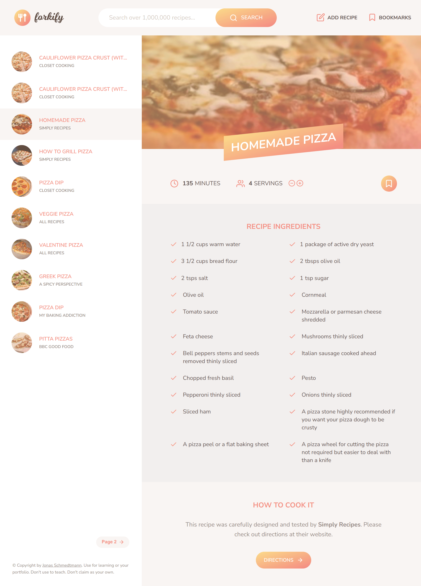

# Forkify

A modern web application that uses Forkify API to allow users to search, view, modify, bookmark and add recipes. Written in HTML, CSS, and Vanilla JavaScript using MVC architecture pattern.

## Demo

You can check the demo [here](https://forkify-09.netlify.app/).

## Features

- Search for recipes.
- Change servings number to update required ingredients quantity.
- Bookmark recipes to view them later.
- Save your own recipes.

## Technologies / External libraries / APIs

- HTML5, CSS, and Vanilla JavaScript.
- Parcel.
- npm.
- [Forkify-API](https://forkify-api.herokuapp.com/v2)

## Notes

This project is part of JavaScript Course by Jonas Schmedtmann on [Udemy](https://www.udemy.com/course/the-complete-javascript-course/).
